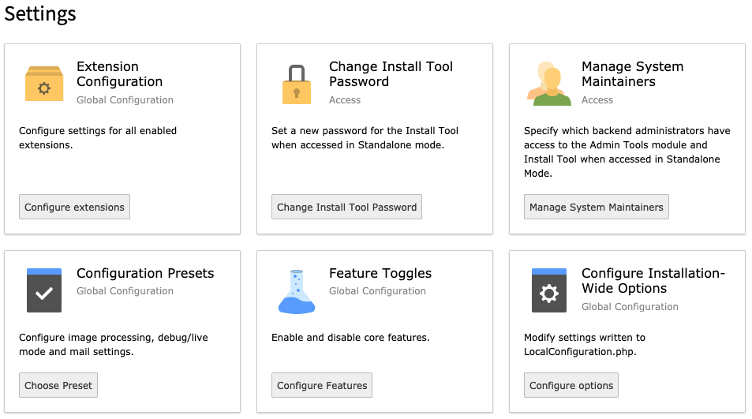
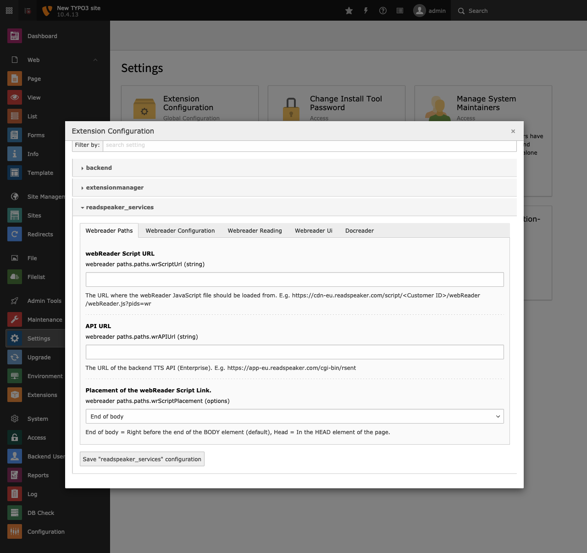
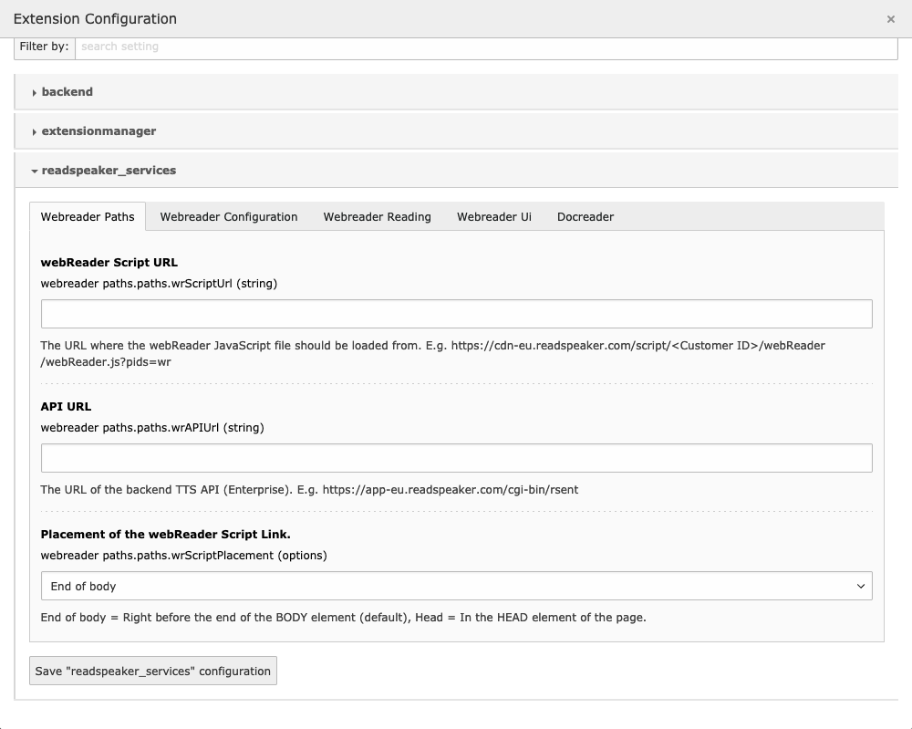
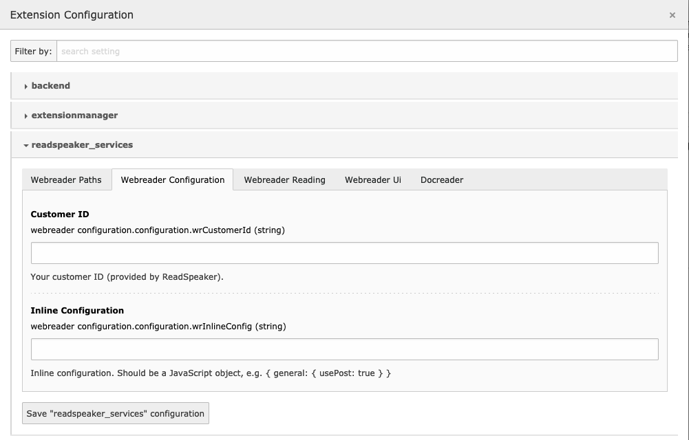
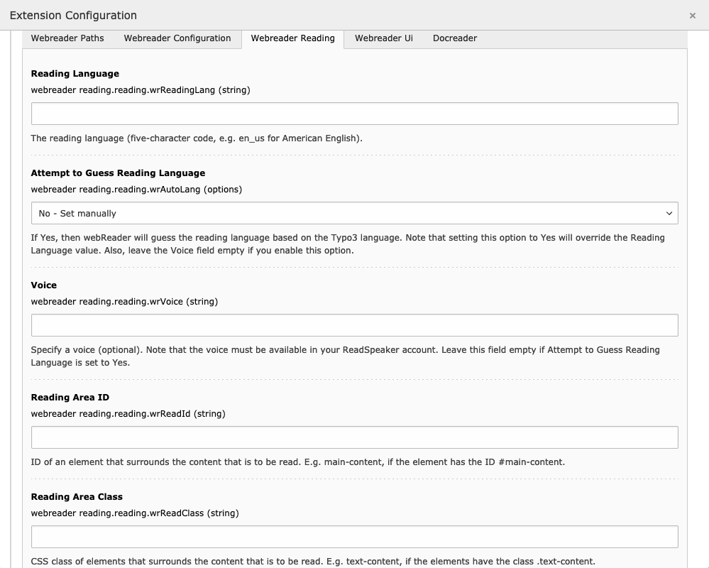
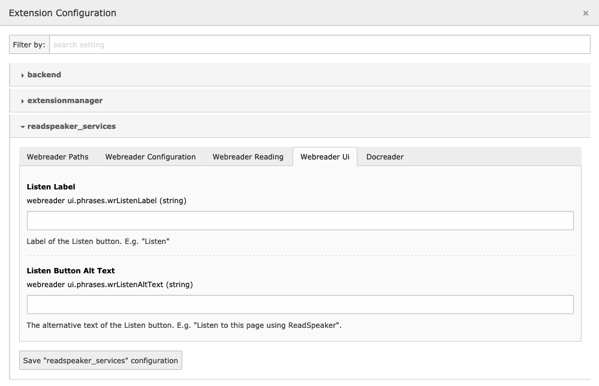
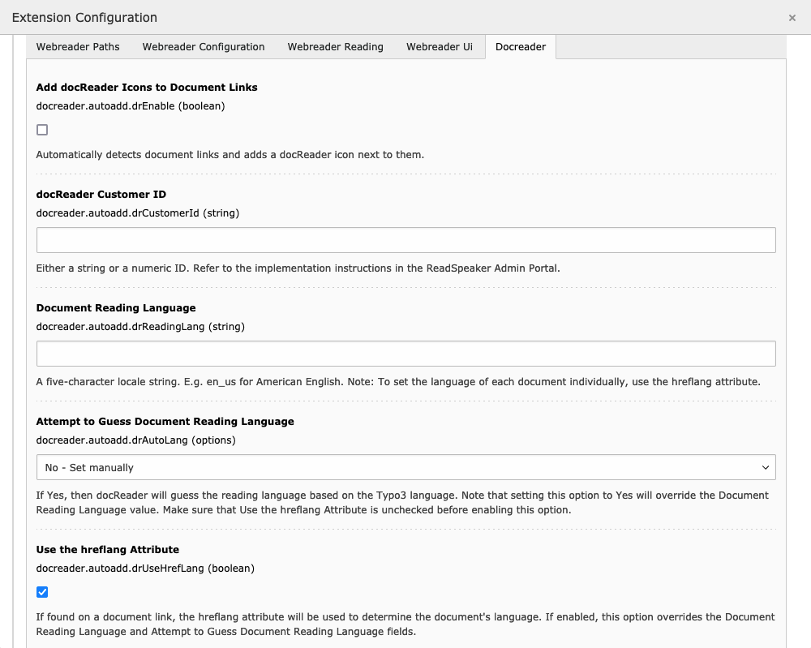
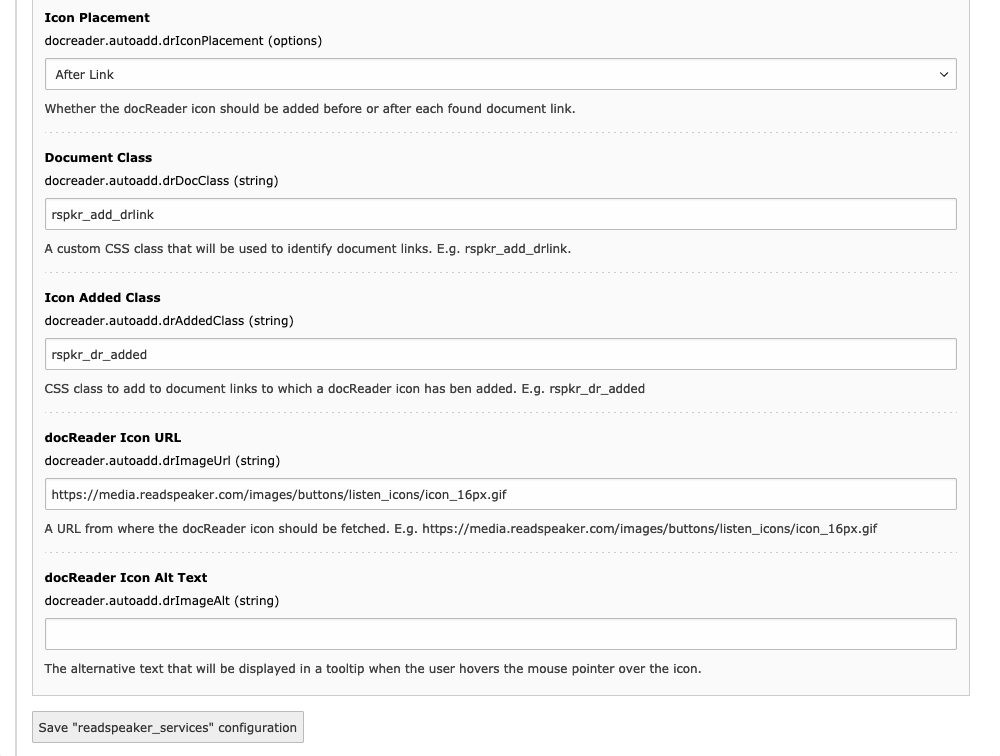
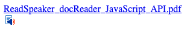
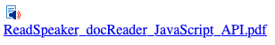

.. include:: ../Includes.txt

.. _configuration:

=============
Configuration
=============

All configuration options are available in the *Extension Configuration* module on the *Admin Tools > Settings* page. You may need to enter your password before you can access the page.

   The Configuration Settings page

----

Click on the :guilabel:`Configure extensions` button to open the configuration panel.

   The Extension Configuration panel

----

Locate the *readspeaker_services* section and expand it. The configuration is divided up into different categories, each represented by a separate tab.

Remember to click on the :guilabel:`Save "readspeaker_services" configuration` button after you have made changes to the configuration.

In the following sections we will go through each configuration setting tab by tab. Note that most configuration options can be overridden in your Fluid templates using tag-based or inline notation. See :ref:`using_fluid_template` for more information. The name of the attribute/parameter to use for each setting will be listed in each section below, under a heading called *Fluid Parameter Name*.

.. _configuration_wr_paths:

Webreader Paths Tab
===================

   The Webreader Paths tab

.. _configuration_wr_paths_url:

webReader Script URL
--------------------

This tells the extension where the webReader JavaScript file should be loaded from. Unless you host the script on your own server, this should be a link to ReadSpeaker's content delivery network. Note that the parameter `pids=wr` must be appended to the URL. This field is required.

This information is available in `ReadSpeaker's customer portal <https://admin.readspeaker.com/portal/>`__. Go to the *Implementation* section and select the implementation instructions for webReader. For more information on script parameters, see the `ReadSpeaker webReader developer site <https://wrdev.readspeaker.com/>`_.

**Example**::

   https://cdn1.readspeaker.com/script/1/webReader/webReader.js?pids=wr

**Fluid Parameter Name**

*This setting should not be overridden.*

.. _configuration_wr_paths_api:

API URL
-------

This field tells the extension where the service that does the actual text-to-speech conversion is located. This field is required.

This information is available in `ReadSpeaker's customer portal <https://admin.readspeaker.com/portal/>`__. Go to the Implementation section and select the implementation instructions for webReader.

**Example**::

   https://app-eu.readspeaker.com/cgi-bin/rsent

**Fluid Parameter Name**

*This setting should not be overridden.*

.. _configuration_wr_paths_placement:

Placement of the webReader Script Link
--------------------------------------

You can decide where the webReader JavaScript (webReader.js) will be inserted into the page.

Depending on the structure of your code, the placement of the JavaScript link can be important, but if you are unsure, set it to End of body, which should work in most cases.

**Fluid Parameter Name**

*This setting should not be overridden.*

.. _configuration_wr_conf:

Webreader Configuration Tab
===========================

   The Webreader Configuration tab

.. _configuration_wr_conf_cid:

Customer ID
-----------

This is the numeric customer ID that you received from ReadSpeaker when you became a customer.

This information is available in `ReadSpeaker's customer portal <https://admin.readspeaker.com/portal/>`__. You will find it on the Account page.

**Example**::

   1234

**Fluid Parameter Name**

``customerId``

.. _configuration_wr_conf_inline:

Inline Configuration
--------------------

webReader allows you to set certain configuration options inline on your web page in the form of a JavaScript object. There are many options available, which you will find on the `ReadSpeaker webReader developer site <https://wrdev.readspeaker.com/>`_.

Note that due to the fact that the text field does not allow line breaks, you need to make the configuration object fit on a single line.

**Example**

Let's say this is your configuration code::

   {
      cb: {
         ui: {
            open: function() {
               console.log('Player opened!');
            }
         }
      },
      ui: {
         tools: {
            translation: false
         }
      }
   }

The above code registers a callback function to be triggered when the webReader player is opened, and disables the translation tool.

In order to enter it into the Inline Configuration field, it must be stripped of line breaks::

   { cb: { ui: { open: function() { console.log('Player opened!'); } } }, ui: { tools: { translation: false } } }

.. tip::

   Replace line breaks with spaces for better readability.

**Fluid Parameter Name**

``inlineConfig``

While this setting can be overridden in your Fluid templates, it's advisable to keep all inline configurations global, to make them easier to maintain.

.. _configuration_wr_reading:

Webreader Reading Tab
=====================

   The Webreader Reading tab

.. _configuration_wr_reading_lang:

Reading Language
----------------

This setting tells webReader which language the page content is in, so that the correct language rules are applied when converting the text to speech.

The value should be a five character locale string, all lowercase, where the language and country codes are separated by an underscore.

If you have a multi-lingual website, you probably want to look at the setting :ref:`configuration_wr_reading_guess` instead of this one.

.. note::

   You can only enter languages that are included in your contract with ReadSpeaker.

**Example**

* ``en_us`` for American English
* ``en_uk`` for British English
* ``de_de`` for German
* ``fr_fr`` for French
* ``pt_pt`` for Portuguese
* ``pt_br`` for Brazilian Portuguese

**Fluid Parameter Name**

``readingLang``

.. _configuration_wr_reading_guess:

Attempt to Guess Reading Language
---------------------------------

If you run a multi-lingual website, it may be a good idea to let the extension guess the reading language based on the language setting for the current page.

This should work most of the time, but the extension is not super smart and will always pick ``en_us`` if the page language is any form of English, for instance.

It's important that you leave the :ref:`configuration_wr_reading_voice` field empty if you set this value to ``Yes - Guess``, since you are likely to end up with an incorrect combination of reading language and voice otherwise.

**Fluid Parameter Name**

``autoLang`` - Possible values are ``yes`` or ``no``.

.. _configuration_wr_reading_voice:

Voice
-----

If you only use a single language and want to specify which voice to use, you can enter the voice name into this field.

The list of available languages and voices can be found in `ReadSpeaker's customer portal <https://admin.readspeaker.com/portal/>`_. Go to *Account > Voices* to see which combinations are available to you.

**Example**

* ``Sophie`` - American English female voice
* ``Mark`` - American English male voice
* ``Maja`` - Swedish female voice
* ``Max`` - German male voice

**Fluid Parameter Name**

``voice``

.. _configuration_wr_reading_area:

Reading Area ID
---------------

In order to let webReader know which content to read, you can specify a single HTML element by its ID (:ref:`configuration_wr_reading_area`) or you can enter a CSS class (:ref:`configuration_wr_reading_class`), in which case all elements with the specified class will be read in the order they appear in the code. If you don't specify ID or CSS class, webReader will read all content in the :html:`<body>` element in the order it appears in the code.

**Example**::

   <body>
      <article id="main-article">
         <header>Article header and meta data</header>
         

            . . .
            Article content
            . . .
         

         <footer>Article footer</footer>
      </article>
   </body>

If you have the above code and want to read only the article content, you set :ref:`configuration_wr_reading_area` to ``article-content``. But if you want to include the header and the footer also, you set it to ``main-article``.

**Fluid Parameter Name**

``readId``

.. _configuration_wr_reading_class:

Reading Area Class
------------------

In order to let webReader know which content to read, you can specify a single HTML element by its ID (:ref:`configuration_wr_reading_area`) or you can enter a CSS class (:ref:`configuration_wr_reading_class`), in which case all elements with the specified class will be read in the order they appear in the code. If you don't specify ID or CSS class, webReader will read all content in the :html:`<body>` element in the order it appears in the code.

**Example**

Ponder this code::

   <body>
      
Some information...

      <article class="advertisement">
         <h2>Volvo XC90, hardly used</h2>
         
Exeptional condition Volvo XC90 for sale...

      </article>

      
General information...

      <article class="advertisement">
         <h2>BMW X5 2020, mint condition</h2>
         
Great car for the family...

      </article>

      
Disclaimer...

   </body>

If we only want webReader to read the car ads we put ``advertisement`` as the value into the :ref:`configuration_wr_reading_class` field.

**Fluid Parameter Name**

``readClass``

.. _configuration_wr_ui:

Webreader UI Tab
================

Use the fields in this section to customize the labels displayed in the Listen button.

   The Webreader UI tab

.. _configuration_wr_ui_label:

Listen Label
------------

This is the text "Listen" that is displayed in the Listen button:

.. figure:: ../Images/webreader-listen-button.png
   :class: with-shadow
   :alt: The Listen button

   The Listen button, the label is "Listen".

Read the :ref:`l10n` section for more information on how to customize the translation for this label. Note that if you enter a value into this field, it will disable the automatic translation detection.

**Fluid Parameter Name**

``listenLabel``

.. _configuration_wr_ui_alt:

Listen Button Alt Text
----------------------

The value of this field is displayed as the tooltip when you hover the mouse over the Listen button:

.. figure:: ../Images/webreader-listen-button-title.png
   :class: with-shadow
   :alt: The Listen button with tooltip

   The Listen button with tooltip

Read the :ref:`l10n` section for more information on how to customize the translation for this text. Note that if you enter a value into this field, it will disable the automatic translation detection.

**Fluid Parameter Name**

``listenAltText``

.. _configuration_dr:

Docreader Tab
=============

.. _configuration_dr_enable:

Add docReader Icons to Document Links
-------------------------------------

Check this box to enable docReader links to be automatically added on a page.

The extension will scan each page (where it has been added) and add a small icon next to each document link. Clicking on the icon will open the linked document in ReadSpeaker docReader.

**Fluid Parameter Name**

``drEnable`` - Possible values are ``0`` or ``1``.

.. _configuration_dr_cid:

docReader Customer ID
---------------------

This is your docReader customer ID, which can be found in `ReadSpeaker's customer portal. <https://admin.readspeaker.com/portal/>`__ Go to the Account page, and you will find it there.

**Example**::

   bmpld

**Fluid Parameter Name**

``drCustomerId``

.. _configuration_dr_lang:

Document Reading Language
-------------------------

This setting tells docReader which language the document content is in, so that the correct language rules are applied when converting the text to speech.

The value should be a five character locale string, all lowercase, where the language and country codes are separated by an underscore.

There are three different ways to tell docReader which language a specific document is in:

* Use the :ref:`configuration_dr_lang` setting. The same language will be applied to all documents on the website.
* Let the page language determine the document language. In this case, use the :ref:`configuration_dr_guess` setting. This is a better option if you have a multi-lingual website.
* Use ``hreflang`` attributes on document links. This way each individual document link can define its language. If you want to use this method, make sure to check :ref:`configuration_dr_href`.

docReader will determine the document language by checking the settings in this order:

#. :ref:`configuration_dr_href` is checked and the link contains a ``hreflang`` attribute.
#. :ref:`configuration_dr_guess` is set to ``Yes - Guess``.
#. The value of the :ref:`configuration_dr_lang` setting.

.. note::

   You can only enter languages that are included in your contract with ReadSpeaker.

**Example**

* ``en_us`` for American English
* ``en_uk`` for British English
* ``de_de`` for German
* ``fr_fr`` for French
* ``pt_pt`` for Portuguese
* ``pt_br`` for Brazilian Portuguese

**Fluid Parameter Name**

``drReadingLang``

.. _configuration_dr_guess:

Attempt to Guess Document Reading Language
------------------------------------------

If you run a multi-lingual website, it may be a good idea to let the extension guess the document's reading language based on the language setting for the current page.

This should work most of the time, but the extension is not super intelligent and will always pick ``en_us`` if the page language is any form of English, for instance.

**Fluid Parameter Name**

``drAutoLang`` - Possible values are ``yes`` or ``no``.

.. _configuration_dr_href:

Use the hreflang Attribute
--------------------------

If your document links contain the ``hreflang`` attribute, check this box to make docReader determine the language based on it.

**Example**

Consider this code::

   <a href="https://www.yourdomain.com/a_document_in_english.pdf" hreflang="en_us">English Document</a>
   <a href="https://www.yourdomain.com/a_document_in_french.pdf" hreflang="fr_fr">French Document</a>

Using the ``hreflang`` attribute you are able to set different document languages on the same page.

**Fluid Parameter Name**

``drUseHrefLang`` - Possible values are ``0`` or ``1``.

.. _configuration_dr_placement:

Icon Placement
--------------

The extension will place a small icon next to any document links it finds on the page. Using this setting you can decide whether the icon should be placed before or after the link.

**Example**

Icon placed after the document link:

----

Icon placed before the document link:

.. note::

   It may seem as the icon placement in the examples above is more a matter of below or above, than after or before, but the placement refers to the position in the code, not on the screen. How the icon is rendered visually should be controlled with CSS.

**Fluid Parameter Name**

``drIconPlacement``

.. _configuration_dr_class:

Document Class
--------------

The extension will look for all links that have a href attribute that contains any of the pre-defined document file extensions:

* .doc
* .docx
* .odt
* .pdf
* .rtf
* .ppt
* .pptx
* .xls
* .xlsx
* .epub

Sometimes, however, your document links will not contain any file extensions, probably because the documents are dynamically generated or served by a server-side component.

In those cases you can add a CSS class to the links in order to tell docReader to process them anyway. The default class is ``rspkr_add_drlink``, but you can set it to whatever you want. Note that it's not possible to add documents of any other type than the ones listed above. If you do, docReader will open with an error message.

**Example**

This example link points to a script that generates PDFs, so we have added a CSS class to indicate that it's a document link::

   <a href="https://www.someapp.com/generate_document.php" class="rspkr_add_drlink">Download Document</a>

**Fluid Parameter Name**

``drDocClass``

.. _configuration_dr_addedclass:

Icon Added Class
----------------

When the extension identifies a document link, it will add a CSS class to the link in order to know that it has been processed. The default class is ``rspkr_dr_added``, but you can set it to whatever you want using this setting.

**Example**

The class ``rspkr_dr_added`` has been added to this link, indicating that a docReader icon has already been added to it::

   <a href="a-file.pdf" class="rspkr_dr_added">
      Download
   </a>

**Fluid Parameter Name**

``drAddedClass``

.. _configuration_dr_iconurl:

docReader Icon URL
------------------

The extension includes an icon image (document with a speaker), but if you want to use your own, you can enter the image url into this field.

**Example**::

   https://mycdn-mydomain.com/images/my-docreader-icon.png

**Fluid Parameter Name**

``drImageUrl``

.. _configuration_dr_alt:

docReader Icon Alt Text
-----------------------

The value of this field is displayed as the tooltip when you hover the mouse over the docReader icon:

.. figure:: ../Images/dr-icon-alt.png
   :class: with-shadow
   :alt: The docReader icon, with tooltip

----

Read the :ref:`l10n` section for more information on how to customize the translation for this text. Note that if you enter a value into this field, it will disable the automatic translation detection.

**Fluid Parameter Name**

``drImageAlt``

