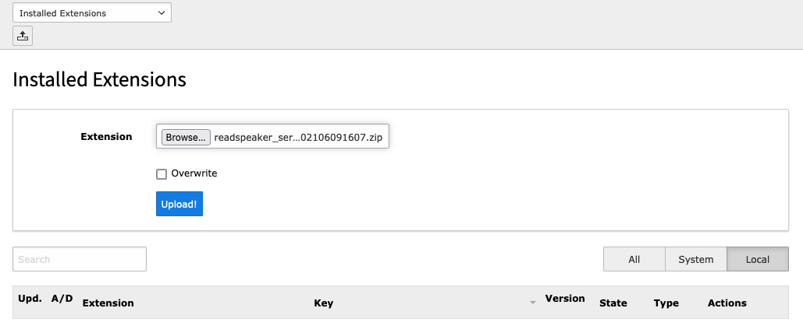
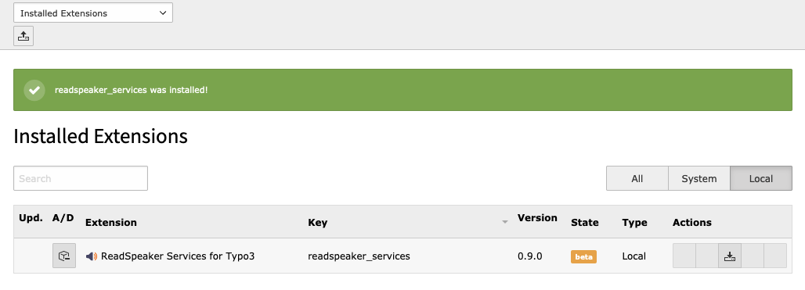

.. include:: ../Includes.txt

.. _installation:

============
Installation
============

Install ReadSpeaker Services like any other extension found on TER, see instructions `here <https://docs.typo3.org/m/typo3/guide-installation/10.4/en-us/ExtensionInstallation/Index.html#extension-installation>`__.

.. _install_manually:

Install from ZIP File
=====================

ReadSpeaker for Typo3 can be installed as a local extension from a zip file. You can obtain the zip file from ReadSpeaker support or download it from `TER <https://extensions.typo3.org/extension/readspeaker_services>`__.

Follow these steps to install the extension:

* Log in to the Typo3 backend using an administrator account.
* Go to the *Admin Tools > Extensions* page.
* Click on the :guilabel:`Upload` button in the top left corner.

   Uploading the extension

* Click on the :guilabel:`Browse` button and locate the zip file on your computer.
* Click on the :guilabel:`Upload` button to start the upload process.
* Once the installation is complete, the ReadSpeaker Services extension will be visible in the table.

   The extension is now available in your Typo3 website
