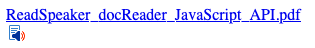

.. include:: ../Includes.txt

.. _introduction:

============
Introduction
============

This document describes the process of installing, configuring and using the ReadSpeaker for Typo3 extension in Typo3 version 10.4+.

.. note::

   You need to have administrator access to the Typo3 backend in order to be able to install and use the extension.

.. _readspeaker_names:

A Note on ReadSpeaker Product Names
-----------------------------------

The correct way to spell the product names is:

* webReader
* docReader

Due to technical limitations we have however had to change the capitalization in some places, in order to comply with Typo3's naming conventions.

.. _what_it_does:

What does it do?
================

ReadSpeaker Services for Typo3 enables you as a Typo3 administrator or editor to easily integrate ReadSpeaker webReader and/or ReadSpeaker docReader into your website.

.. _screenshots:

Screenshots
===========

   ReadSpeaker webReader in action

   ReadSpeaker docReader icon rendered on a web page.
