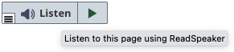
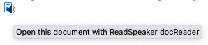

.. include:: ../Includes.txt

.. _l10n:

============
Localization
============

The products webReader and docReader have localization built in. The general rule is that the UI of webReader and docReader will follow the reading language. In the ReadSpeaker Services extension for Typo3 it is however possible to customize three phrases that are part of the extension, but not part of the products per se. These are:

.. |lbl| image:: ../Images/webreader-listen-button.png

======================  ===================================
Label                   Screenshot
======================  ===================================
Listen button label     |lbl|
Listen button tooltip   |lbt|
docReader icon tooltip  |dit|
======================  ===================================

So, when we talk about localization/translation in this document, it only concerns the three phrases above.

The extension comes with a number of built-in translations for webReader's and docReader's button label and tooltips.

Which translation to use will be automatically determined by the page's language setting, unless values have been set in the configuration (:ref:`configuration_wr_ui_label`, :ref:`configuration_wr_ui_alt`, or :ref:`configuration_dr_alt`), in which case the configuration always wins.

.. _l10n_wr_trans:

Translations for webReader
==========================

Translations for webReader are pre-installed in the following languages:

.. hlist::
   :columns: 3

   * Arabic
   * Catalan
   * Chinese (Trad)
   * Croatian
   * Czech
   * Danish
   * Dutch
   * English
   * Faroese
   * Farsi
   * Finnish
   * French
   * Galician
   * German
   * Greek
   * Hindi
   * Hungarian
   * Icelandic
   * Italian
   * Japanese
   * Korean
   * Latvian
   * Norwegian
   * Polish
   * Portuguese
   * Romanian
   * Russian
   * Slovak
   * Spanish
   * Swedish
   * Thai
   * Turkish

.. _l10n_dr_trans:

Translations for docReader
==========================

The extension comes preinstalled with phrases in the following languages for docReader:

.. hlist::
   :columns: 3

   * Arabic
   * Catalan
   * Danish
   * Dutch
   * English
   * Faroese
   * Farsi
   * Finnish
   * French
   * Galician
   * German
   * Hungarian
   * Italian
   * Japanese
   * Latvian
   * Norwegian
   * Polish
   * Portuguese
   * Russian
   * Spanish
   * Swedish
